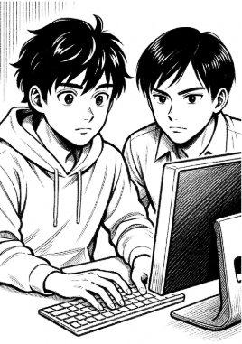

# T03: Seguretat Lògica: recuperant accés a sistemes

Després de la primera feina exitosa, us arriba un encàrrec urgent que obliga a que us hi poseu per donar-li solució.

Com a fase prèvia, rebreu una **formació sobre la seguretat lògica** que us permetrà tenir els coneixements necessaris per afrontar la tasca.

## Context
Han arribat a la consultora un equip provinent d’un client que demana que els hi solucionem el problema.  

- Equip: **Portàtil amb Zorin OS** (Linux amb entorn gràfic) usat habitualment per un directiu.  
- Problema: El directiu ha oblidat la contrasenya i cal recuperar l’accés perquè hi ha documentació molt important.  
- Solució segura: Per evitar danyar l’equip original, s’ha **clonat el disc en un disc virtual** sobre el qual treballareu.

## Passos inicials
1. Crear una **màquina virtual** i connectar-hi el disc clònic.  
2. Entrar a la màquina virtual.  
3. Trobar el **nom de l’usuari existent** i assignar-li una **nova contrasenya**.  
4. Verificar que l’usuari ja té accés al sistema.

## Reforç de la seguretat
Quan el client és informat de la facilitat d’accés, demana mesures per protegir el sistema.  
- Objectiu: Evitar que algú pugui reiniciar la contrasenya utilitzant el procediment anterior.  
- Solució: **Protegir l’accés al GRUB amb contrasenya** per impedir canvis de configuració.

## Procediment individual
1. Vulnereu l’accés al **GRUB** del Linux.  
2. Identifiqueu l’**usuari del sistema**.  
3. Modifiqueu la **contrasenya de l’usuari** i verifiqueu que ara té accés.  
4. Investigueu com fortificar l’accés al GRUB (incloure fonts d’informació utilitzades).  
5. Configureu la **màquina virtual** per protegir l’accés al GRUB.  
6. Documenteu tot el procediment en un document (incloure imatges) per pujar-lo posteriorment al vostre repositori.

## Material de suport
- **Disc virtual**  
- Apunts **RA1AA4 Seguretat Lògica**  
- Recuperació de contrasenya en Linux: [WaytoIT - Recuperando Password en Ubuntu](https://waytoit.wordpress.com/2013/06/06/recuperando-password-en-ubuntu/)

## Solució
A l'arxiu [solucio.md](solucio.md) hi ha solució descrita.

[Tornar pàgina projecte](../README.md)
