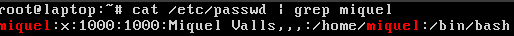

# T03: Seguretat Lògica: recuperant accés a sistemes

## Recuperació de la contrasenya d'usuari

Amb el disc virtual facilitat pel client, creem una màquina virtual Linux sense disc i hi afegim el disc virtual proporcionat.


En iniciar la màquina, podem observar que hi ha un usuari anomenat **Miquel Valls**.


Reiniciem la màquina prement repetidament la tecla **Shift** per interrompre l’arrencada i accedir a les opcions avançades, des d’on entrarem en el mode de recuperació.


Al menú de recuperació, seleccionem l’opció **root** per accedir a la consola del superusuari.


Un cop dins, hem de muntar el sistema en mode lectura/escriptura amb la comanda `mount -rw -o remount /`, ja que, en cas contrari, no ens permetrà canviar la contrasenya i mostrarà un error com aquest:

```
Authenticacion token manipulation error
passwd: password unchanged
```

Després, fem un `cat /etc/passwd` per veure l’usuari de Miquel Valls i comprovem que el seu nom d’usuari és `miquel`.



Ara ja podem executar la comanda següent per canviar la seva contrasenya:


Assignem la nova contrasenya: **everpia2025**.

Finalment, reiniciem la màquina amb normalitat i ja podrem iniciar sessió sense problemes amb la nova contrasenya.


Verifiquem que podem accedir amb normalitat a l’usuari després del canvi de contrasenya.


---

## Fortificació de l’accés al GRUB

Un cop hem comprovat com de ràpid és canviar la contrasenya, el client ens demana protegir l’equip de manera que l’accés al GRUB quedi protegit amb contrasenya, per tal d’evitar modificacions a la configuració del sistema.

La solució és **fortificar l’accés al GRUB**, establint un usuari i una contrasenya per evitar que algú amb accés físic a la màquina pugui modificar els paràmetres d’arrencada, entrar en mode de recuperació o accedir a la terminal com a root per fer canvis al sistema.

### 1. Generar una contrasenya xifrada per al GRUB

El primer pas és **generar una contrasenya xifrada per al GRUB** en format **hash**, amb la comanda:

```bash
grub-mkpasswd-pbkdf2
```

Però com que **afegir manualment el hash a un fitxer no és pràctic**, farem servir l’ordre **tee**, que ens permet **redirigir la sortida estàndard cap a un fitxer**. Per tant, escriurem:

```bash
grub-mkpasswd-pbkdf2 | tee hash.txt
```


Assignem la contrasenya: **everpia2025@**

### 2. Editar el fitxer de configuració del GRUB

Editem el fitxer `/etc/grub.d/40_custom` per afegir-hi l’autenticació. Incloem el hash generat anteriorment.

Obrim l’editor nano amb multibuffer:

```bash
sudo nano -F /etc/grub.d/40_custom
```


Premem `CTRL + R` i introduïm el nom del fitxer d’origen (`hash.txt`). Veiem el contingut del fitxer a la pantalla.


Copiem el bloc de text amb el hash. Ens situem a l’inici de la línia, premem `ALT + A`, anem fins al final (amb el cursor o `CTRL + E`) i copiem amb `ALT + 6`. Tanquem el fitxer amb `CTRL + X`.

De nou dins `/etc/grub.d/40_custom`, afegim al final les següents línies:

```bash
set superusers="nom_login"
password_pbkdf2 nom_login <hash_generat>
```

**Nota:**  
- `nom_login` és l’identificador per autenticar-nos al GRUB.  
- El hash s’enganxa a la segona línia després del nom d’usuari (`CTRL + U`).  
- Aquest usuari no cal que coincideixi amb un usuari del sistema operatiu.


Un cop fet, desem i sortim de nano.

### 3. Aplicar els canvis a la configuració del GRUB

Executem:

```bash
sudo grub-mkconfig -o /boot/grub/grub.cfg
```


Després reiniciem el sistema i comprovem que ens demana usuari i contrasenya abans de carregar el gestor d’arrencada.


---

## Resultat

Amb aquest procediment, protegim el nostre equip contra accessos no autoritzats, tant pel que fa a la recuperació de contrasenyes com a la modificació de la configuració d’arrencada.

[Tornar a enunciat](README.md)
